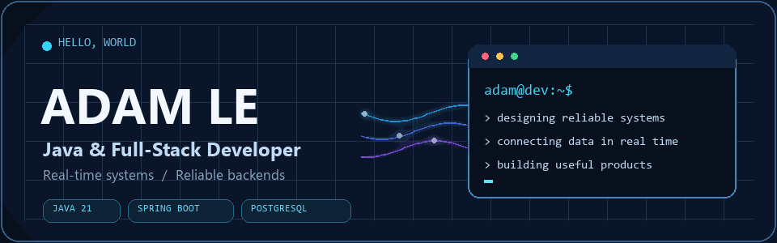

  

<h1 align="center">
  <picture>
    <source media="(prefers-reduced-motion: reduce)" srcset="assets/typing-name-static.svg" />
    
  </picture>
</h1>

  <strong>Java &amp; Full-Stack Developer</strong>

  Building real-time systems and reliable backend services.

---

### About me

I have 4+ years of experience building and operating production systems with **Java and Spring Boot**. My work spans real-time workflows, odds aggregation, provider integrations, asynchronous messaging, SQL tuning, and production troubleshooting. I also build full-stack products with **React and Next.js**.

- 🔭 Focused on backend performance, I/O-bound concurrency, and dependable integrations.
- ⚡ Reduced one odds aggregation flow from **201 database queries to 1 per processing cycle**.
- 🌱 Continuing to learn and build across backend architecture and user-facing products.

 

### Tech stack

| Area | Technologies |
| --- | --- |
| **Backend & messaging** | `Java 21` `Spring Boot` `Spring Data JPA` `Node.js` `Express.js` `RabbitMQ` `WebSocket` |
| **Data** | `PostgreSQL` `MySQL` `SQL Server` `Redis` |
| **Frontend & delivery** | `TypeScript` `React` `Angular` `Next.js` `Docker` `OpenAPI` |

### Selected work

| Project | What I worked on | Stack |
| --- | --- | --- |
| **Real-Time Systems** | Backend services and provider integrations for live betting workflows; REST, messaging, and WebSocket flows. Client details are confidential. | `Java 21` `Spring Boot` `RabbitMQ` `WebSocket` |
| **Odds Monitor** | Owned an internal module for ingesting, normalizing, storing, and analyzing odds data. | `Node.js` `Express.js` `PostgreSQL` `MySQL` |
| **[Bếp Nhà Mình](https://github.com/ltqhuy0112/bep_nha_minh)** | Personal bilingual website and operations platform with customer and admin workflows. | `Next.js` `React` `PostgreSQL` `Docker` |

### How I work

I enjoy tracing a problem from the API through messaging and data access, then making a focused change that is measurable and easy to maintain. I value clear interfaces, targeted tests, and production evidence.

  Thanks for visiting &middot; Built with care for readable code and reliable systems

